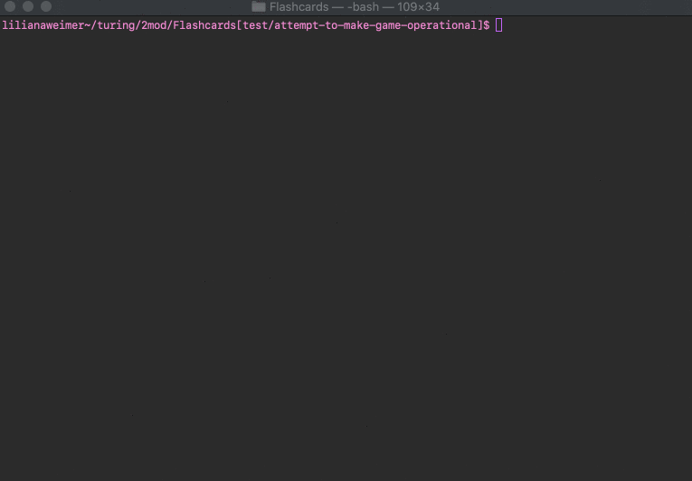
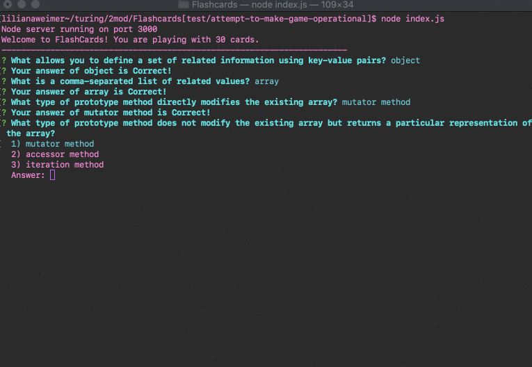
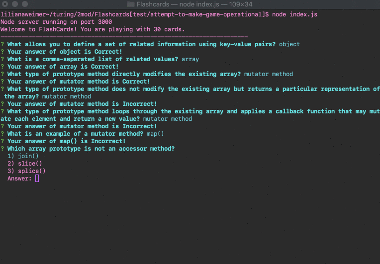

# FlashCards

## Abstract

This was the first solo project of Mod 2 at the Turing School of Software & Design. The goal was to create a flashcards application that runs solely in the console, using test-driven development. Additional learning goals were learning to write Mocha/Chai tests, practicing test-driven development, and introducing ES6 into practice.

## In Action

Answering correctly

Answering incorrectly

Ending a round

## Install and Setup

To install:
- Clone the repo into desired directory
- Open console and navigate to the directory

To run:
- While in the `Flashcards` directory (in the console), enter `node index.js`
- Use arrow keys and enter to play!
